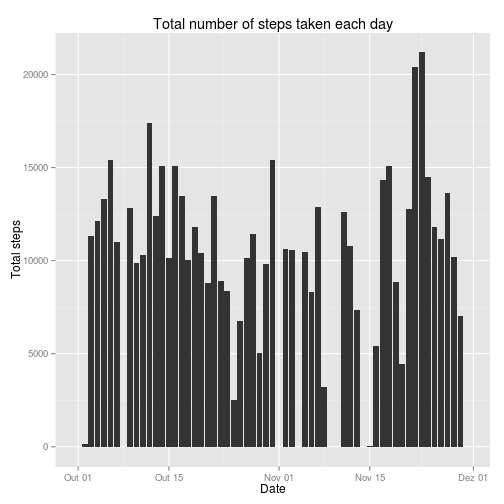
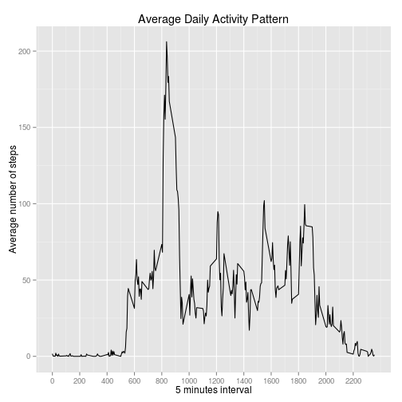
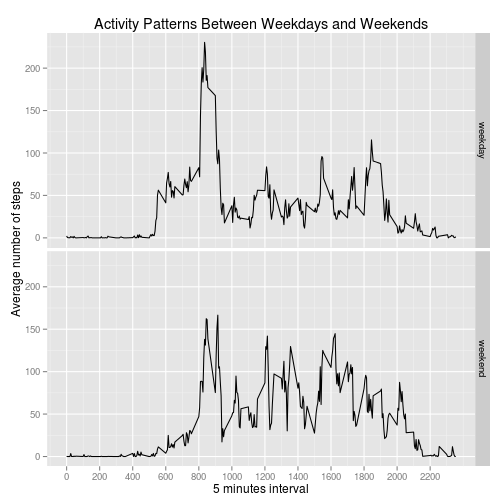

# Reproducible Research: Peer Assessment 1

In this assignament is used the CVS file called "activity", which has to be
unziped and loaded from the root folder, same folder of this file.

To create histograms and other plots, I am using the library "ggplot2".

To work with weekdays in other languages avoiding problems with translation,
I am using "lubridate".

## Loading and preprocessing the data

Assumption: the "activity.zip" file is in the same directory.
Loading the data in a raw format:

```r
unzip(zipfile="activity.zip")
raw.data <- read.csv("activity.csv")
```

Transforming the "date" column type from character to Date:

```r
date <- as.Date(raw.data[,2],"%Y-%m-%d")
data <- cbind(subset(raw.data,select=-date),date)
```


## What is mean total number of steps taken per day?

Ignoring the missing values (NA), let's sum and group the steps by date:

```r
total.steps.by.day <- aggregate(x=list(Steps=data$steps),
                                by=list(Date=data$date),
                                FUN=sum, na.rm=TRUE)
```

With this aggregation, let's create a histogram:

```r
library(ggplot2)
qplot(data=total.steps.by.day, binwidth=300, margins=TRUE, geom="histogram",
      main="Total number of steps taken each day", stat="identity",
      x=Date, xlab="Date",
      y=Steps, ylab="Total steps")
```

 

The **mean** total number of steps taken per day is given by:

```r
mean(total.steps.by.day$Steps, na.rm=TRUE)
```

```
## [1] 9354
```

The **median** total number of steps taken per day is given by:

```r
median(total.steps.by.day$Steps, na.rm=TRUE)
```

```
## [1] 10395
```

## What is the average daily activity pattern?

To get this pattern, we have to use the "mean" function grouping by interval:

```r
steps.avg.by.interval <- aggregate(x=list(Steps=data$steps),
                                by=list(Interval=data$interval),
                                FUN=mean, na.rm=TRUE)
```

Create a plot with the averagenumber of steps by day:

```r
library(ggplot2)
qplot(data=steps.avg.by.interval, binwidth=300, margins=TRUE, geom="line",
      main="Average Daily Activity Pattern", stat="identity", 
      x=Interval, xlab="5 minutes interval",
      y=Steps, ylab="Average number of steps") +
    scale_x_continuous(breaks = seq(0,max(steps.avg.by.interval$Interval),100))
```

 

The **maximum** average of steps taken per day is given by:

```r
max(steps.avg.by.interval$Steps)
```

```
## [1] 206.2
```

## Imputing missing values

Before imputing a value for the missing values, let's count them in the dataset:

```r
sum(is.na(data))
```

```
## [1] 2304
```

So this is the total rows with missing values in steps column.
The purpouse is fill the "steps" field in each observation with NA with the
**median** value for the interval.

This function is responsible to replace the missing valu to the median value
for the interval:

```r
replaceNA <- function(steps, interval) {
    value <- NA
    if (is.na(steps)) {
        value <- (steps.avg.by.interval[steps.avg.by.interval$Interval==interval, "Steps"])
    } else {
        value <- c(steps)
    }
    return(value)
}
```

Let's copy the original dataset to one which we'll fill with the above condition:

```r
filled.data <- data
filled.data$steps <- mapply(replaceNA, filled.data$steps, filled.data$interval)
```

Now, I am doing the same thing I did before - sum and group the steps by date -
but now with no missign values:

```r
total.steps.by.day.filled <- aggregate(x=list(Steps=filled.data$steps),
                                by=list(Date=filled.data$date),
                                FUN=sum)
```

With this new aggregation, let's create a histogram:

```r
library(ggplot2)
qplot(data=total.steps.by.day.filled, binwidth=300, margins=TRUE, geom="histogram",
      main="Total number of steps taken each day", stat="identity", 
      x=Date, xlab="Date",
      y=Steps, ylab="Total steps")
```

 

The **mean** total number of steps taken per day, now, is given by:

```r
mean(total.steps.by.day.filled$Steps)
```

```
## [1] 10766
```

The **median** total number of steps taken per day, now, is given by:

```r
median(total.steps.by.day.filled$Steps)
```

```
## [1] 10766
```

## Are there differences in activity patterns between weekdays and weekends?

To do a good work and avoid problems with languages, I am using the library
"lubridate", that give me 1 to 7 when the function "wday()" is used.
If I use the "weekdays()" like in the instruction, I would get
"Sábado" and "Domingo" instead of "Saturday" and "Sunday", for instance.

```r
library(lubridate)
typeOfDay <- function(date) {
    value <- ""
    if (wday(date) %in% c(1,7)) {
        value  <- "weekend"
    } else {
        value  <- "weekday"
    }
    return(value)
}
```

Now, I create a new column with the type of day, to break by this new column
in the agregation:

```r
filled.data$type.of.day <- sapply(filled.data$date, FUN=typeOfDay)

steps.avg.by.interval.filled <- aggregate(steps ~ interval + type.of.day,
                                   data=filled.data, FUN=mean, na.rm=TRUE)
```

With this new aggregation with no missing values and divided by "weekday" and
"weekend", let's create a histogram:

```r
library(ggplot2)
qplot(data=steps.avg.by.interval.filled, binwidth=300, margins=TRUE, geom="line",
      main="Activity Patterns Between Weekdays and Weekends", stat="identity", 
      x=interval, xlab="5 minutes interval",
      y=steps, ylab="Average number of steps") +
    facet_grid(type.of.day ~ .) + 
    scale_x_continuous(breaks = seq(0,max(steps.avg.by.interval$Interval),100))
```

 

